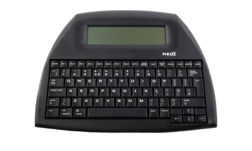
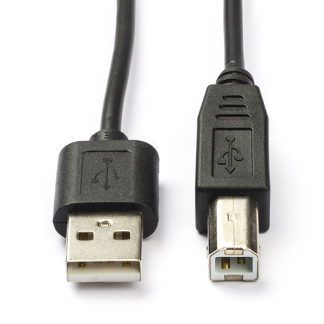
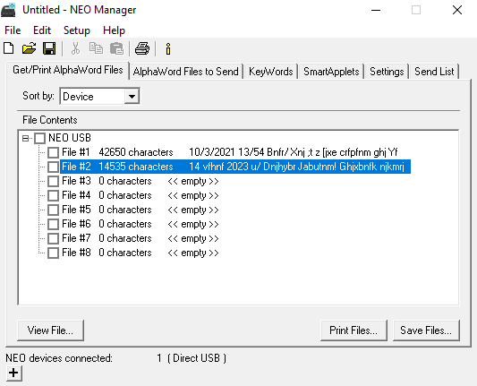
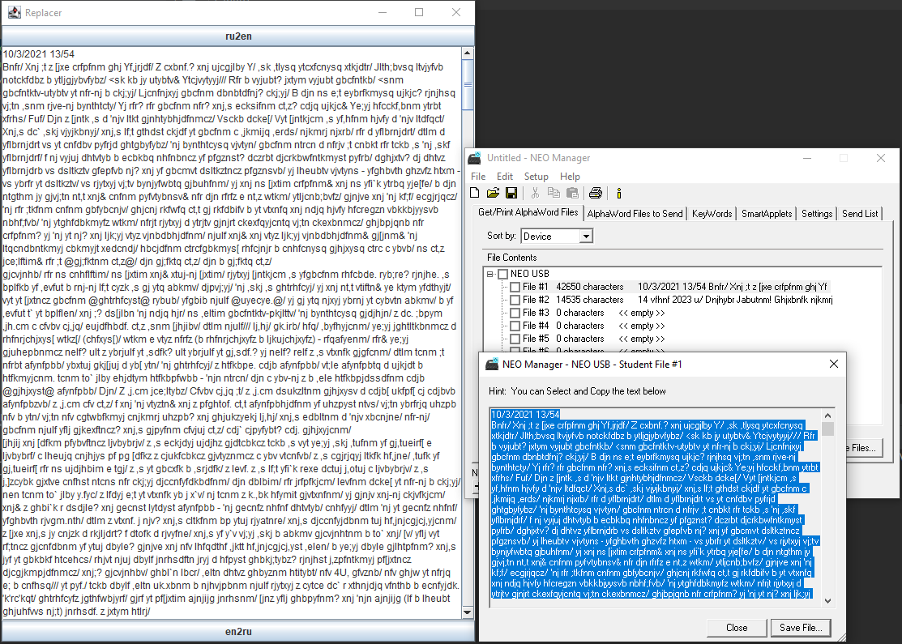

# neo2ru

Suppose you have this device:

It's called <a href="https://en.wikipedia.org/wiki/AlphaSmart">AlphaSmart Neo 2</a>.

And you want to type Russian (Cyrillic) characters on it and then transfer your texts to your PC.

How would you do it?

You would need a data cable like this one:

And a PC with a Windows operating system. In my test here I'm using Windows 10.

You need to install <a href="https://www.renlearn.co.uk/neo-2/manuals-and-downloads/">the driver and the Neo2 manager</a>.

If Neo Manager still cannot find your device, do this:

In the Device Manager --> Devices --> Alphasmart is with a yellow (warning sign) ---> Right click ---> Update driver ---> Browse my computer for drivers ----> Let me pick from the list of available drivers ---> Keyboard.

When you successfully connect Neo2 to your PC you will see it in the Neo Manager:

# Font Installation

As stated by the font author <a href="https://www.flickr.com/groups/alphasmart/discuss/72157691753726892/72157697778942004">here</a>.

1. Download the font (1st link). Unzip it.
2. Download NeoManager and install it.
3. Connect your Neo via usb.
3. Double-click on the font file. It should appear in your NeoManager in the SmartApplets pane in the "Install list" as "Neo Font - Custom Font 6".
4. Go to "Send List" pane in NeoManager.
5. Click "Send" and wait until it finishes.

Now on your Neo go to Applets-> Control Pane -> Change default AlphaWord font -> Custom Font 6.

Go back to AlphaWord and enjoy your Russian font :).

# Replacer

The author of the font says that characters are automatically converted to Cyrillic when he copies and pastes texts.

Well, not for me. That's why I wrote this program.

You need to install Java (at least 17). Just double-click on the jar file. You should see something like this:

Basically you need to copy the text from the Neo Manager text field to the Replacer and then click on the button "en2ru".

That's it! Your gibberish will be converted back to Russian and you can further copy it and paste to a safe place where you keep your texts.

# Downloads

Apart from the release section you can also download all the files mentioned above from the dist folder of this repository.

Happy writing!

# Links

1. https://en.wikipedia.org/wiki/AlphaSmart
2. https://www.flickr.com/groups/alphasmart/discuss/72157691753726892/72157697778942004
3. https://www.renlearn.co.uk/neo-2/manuals-and-downloads/
